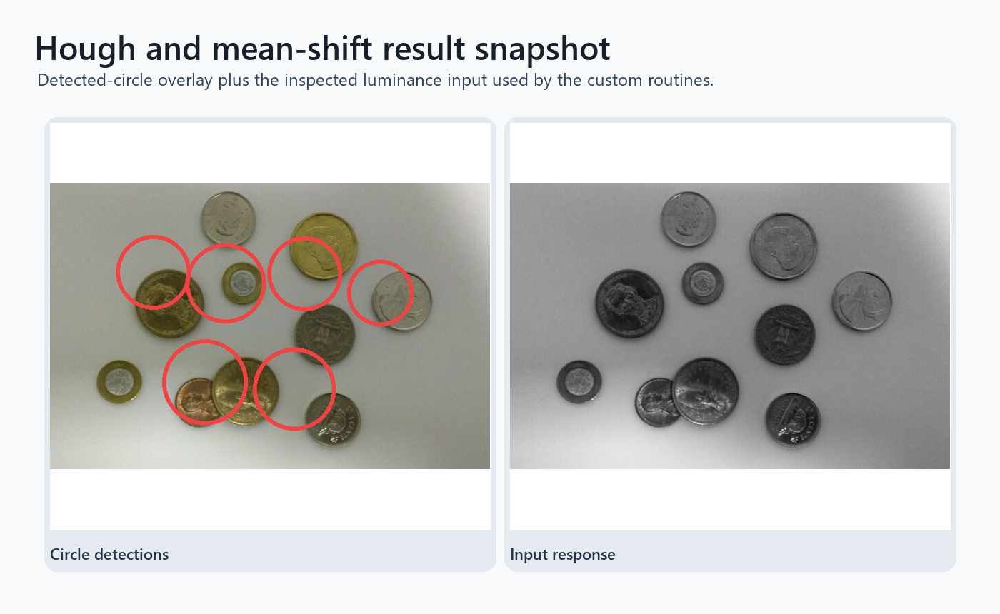

# Hough Circles and Mean Shift Segmentation

Classical vision implementations for shape matching, circular object detection, and color-space segmentation.

## Highlights

- Implements a 5-7-11 chamfer distance transform for binary shape matching.
- Detects circular objects with a custom Hough voting pipeline and non-maximum suppression.
- Segments images using mean shift clustering in joint color/spatial feature space.
- Includes small synthetic shape inputs and natural-image examples.

## Repository Layout

- `chamfer_distance_transform.py` - distance-transform shape matching.
- `hough_circles_meanshift.py` - Hough circle detection and mean shift segmentation.
- `data/` - source images used by the scripts.

## Setup

```bash
pip install -r requirements.txt
```

## Run

```bash
python chamfer_distance_transform.py
python hough_circles_meanshift.py
```

## Segmentation output



Detected-circle overlay and inspected luminance input for the Hough/mean-shift routines.


## Detection and clustering workflow

- Classical shape detection and segmentation pipelines built from interpretable steps.
- Use of synthetic shapes plus natural-image examples for quick sanity checks.
- A practical bridge between distance transforms, Hough voting, and mean-shift segmentation.


## Known boundaries

- The scripts depend on OpenCV for the full runnable path.
- Circle-detection parameters are example-oriented rather than fully automatic.
- Next steps: add saved output artifacts from every script and document parameter sensitivity.

